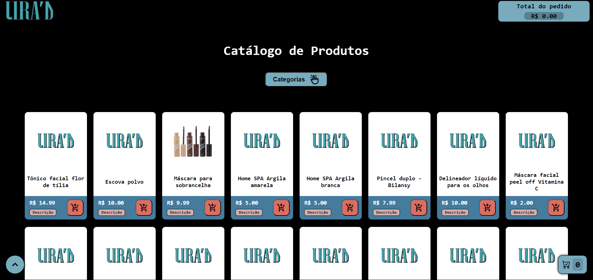

# React E-commerce Portfolio

[](https://seu-catalogo-liras.vercel.app/)


Uma aplicação de e-commerce moderna e responsiva, construída com as tecnologias mais recentes do ecossistema React. Este projeto serve como um portfólio para demonstrar habilidades em desenvolvimento front-end, incluindo gerenciamento de estado, componentização, consumo de APIs e boas práticas de desenvolvimento.

**[➡️ Acesse a demonstração ao vivo](https://seu-catalogo-liras.vercel.app/)**

<p align="center">
  
</p>

## ✨ Funcionalidades

- [x] Listagem de produtos com busca e filtros.
- [x] Página de detalhes do produto.
- [x] Carrinho de compras funcional.
- [x] Design totalmente responsivo para desktops, tablets e celulares.
- [ ] Filtro avançado por categoria.
- [ ] Componente de descrição do produto.

## 🚀 Tecnologias Utilizadas

Este projeto foi desenvolvido utilizando as seguintes tecnologias:

- **Front-end:**
  - [React](https://reactjs.org/)
  - [TypeScript](https://www.typescriptlang.org/)
  - [Vite](https://vitejs.dev/)
  - [Css Modules](https://github.com/css-modules/css-modules)
  - [React Router](https://reactrouter.com/)
- **Back-end / Banco de Dados:**
  - [Firebase](https://firebase.google.com/products/realtime-database?hl=pt-br) (Realtime Database)
- **Gerenciamento de Estado:**
  - [Context API](https://reactjs.org/docs/context.html)

## 📦 Instalação e Execução

Siga os passos abaixo para executar o projeto em seu ambiente local.

**Pré-requisitos:**
- [Node.js](https://nodejs.org/en/) (versão 16 ou superior)
- [npm](https://www.npmjs.com/) ou [Yarn](https://yarnpkg.com/)

```bash
# 1. Clone o repositório
git clone https://github.com/ericssendelima/react-ecommerce-portfolio.git

# 2. Navegue até o diretório do projeto
cd react-ecommerce-portfolio

# 3. Instale as dependências
npm install
# ou
yarn install

# 4. Crie um arquivo .env na raiz do projeto e adicione suas credenciais do Firebase
# Veja o arquivo .env.example para referência
VITE_FIREBASE_API_KEY=sua_api_key
VITE_FIREBASE_AUTH_DOMAIN=seu_auth_domain
VITE_FIREBASE_PROJECT_ID=seu_project_id
VITE_FIREBASE_STORAGE_BUCKET=seu_storage_bucket
VITE_FIREBASE_MESSAGING_SENDER_ID=seu_sender_id
VITE_FIREBASE_APP_ID=seu_app_id

# 5. Inicie o servidor de desenvolvimento
npm run dev
# ou
yarn dev
```

Abra [http://localhost:5173](http://localhost:5173) (ou a porta indicada no terminal) para visualizar a aplicação no seu navegador.

## 🤝 Contribuições

Contribuições são bem-vindas! Se você tiver sugestões para melhorar este projeto, sinta-se à vontade para criar um *fork* do repositório e abrir um *pull request*. Você também pode simplesmente abrir uma *issue* com a tag "enhancement".

1.  Faça um *fork* do projeto.
2.  Crie uma nova *branch* (`git checkout -b feature/AmazingFeature`).
3.  Faça o *commit* de suas alterações (`git commit -m 'Add some AmazingFeature'`).
4.  Faça o *push* para a *branch* (`git push origin feature/AmazingFeature`).
5.  Abra um *Pull Request*.

## 📄 Licença

Este projeto está sob a licença MIT. Veja o arquivo [LICENSE](LICENSE) para mais detalhes.

--

Feito com ❤️ por Yalê Ericssen